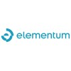
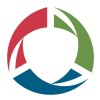

# Sebastian Calle

 &nbsp;
 &nbsp;
 &nbsp;

---

## Professional Summary

**Principal Software Engineer** with 15+ years of experience specializing in Backend Development, Infrastructure, and Developer Productivity, now pivoting to **AI and Agentic** technologies. I bring a unique perspective on reliability—stemming from a background in Quality Engineering—to build robust, AI-driven tooling that empowers engineering organizations.

---

## Technical Skills

| Category                   | Technologies                                    |
|:---------------------------|:------------------------------------------------|
| **Languages**              | Golang, TypeScript, Python                      |
| **Infrastructure**         | Kubernetes, Docker, Helm, Terraform, Buildpacks |
| **AI**                     | MCP, A2A, RAG, Ragas, LangChain, Strands        |
| **CI/CD**                  | Jenkins, GitHub Actions                         |
| **Cloud Providers**        | AWS                                             |
| **Testing Frameworks**     | Selenium, Cypress, Protractor, Puppeteer        |
| **Performance Frameworks** | JMeter, BlazeMeter                              |

---

## Professional Experience

### [Salesforce](https://www.linkedin.com/company/salesforce/) - Principal Software Engineer
*Jun 2024 – Present*

* **CI/CD Pipeline:** Architected a pipeline for **Agentforce** Agents, enabling automated testing and artifact deployment across the entire T&P organization.
* **Governance & Standards:** Defined the "VibeCode" comprehensive rule set to govern and standardize the development process for **Agentforce** Agents.
* **Integration Architecture:** Developed a suite of **MCP** Servers to standardize and support the company's most critical third-party integrations.
* **Internal Enablement:** Accelerated internal AI adoption by evaluating business unit products and creating technical documentation and working examples for Agent related capabilities such as Data Ingestion, RAG, MCP, A2A.
* **Strategic Vendor Evaluation:** Led the evaluation of the external AI landscape (including Google, Anthropic, Anysphere, OpenAI, etc.) to guide company-wide adoption and procurement strategies.
* **Stakeholder Feedback:** Established a direct feedback loop between internal stakeholders and Product teams through regular office hours to drive platform improvements.

### [MuleSoft](https://www.linkedin.com/company/mulesoft/) - Principal Software Engineer
*Mar 2019 – Jun 2024 (5 years 4 months)*

* **CI Pipeline:** Created a unified CI pipeline to test, build, and publish artifacts, ensuring consistent and reliable software delivery across the entire company.
* **Developer Productivity:** Focused on creating internal tooling to streamline the entire SDLC for engineers.
* **Microservices Architecture:** Designed, developed, and maintained scalable backend microservices using **Golang**, **JavaScript**, and **TypeScript**.
* **Infrastructure as Code:** Provisioned and managed AWS resources utilizing **Terraform**, ensuring reproducible infrastructure environments.
* **Container Orchestration:** Containerized applications using **Docker** and managed complex deployments on **Kubernetes** clusters via custom **Helm** charts.
* **Organization Player:** Provided dedicated, long-term engineering support to multiple infrastructure teams in the organization to accelerate the delivery of critical company-wide initiatives.

### [Elementum SCM](https://www.linkedin.com/company/elementum-supplychain/about/) - Software Engineer In Test
*Oct 2017 – Mar 2019 (1 year 6 months)*

* **Test Automation:** Developed robust automated test suites for Angular web applications using Protractor and Java backend services using TestNG.
* **Performance Engineering:** Executed performance and load testing strategies for web applications using JMeter and BlazeMeter.
* **Release Management:** Coordinated platform releases on a 2-week cycle, bridging the gap between development teams and production deployment.
* **Quality Assurance:** Performed exploratory testing for web applications to identify edge cases and usability issues.
* **Hiring:** Conducted interviews to evaluate candidates for technical roles.

### [Gilbarco Veeder-Root](https://www.linkedin.com/company/gilbarco-veeder-root/) - Quality Engineer
*Jun 2013 – Oct 2017 (4 years 5 months)*

* **CI/CD Implementation:** Created pipelines from scratch to execute automated test suites and perform regression testing on nightly releases.
* **Automation Frameworks:** Developed a custom testing framework using **Python** and AutoIt to automate Windows desktop application testing.
* **Process Improvement:** Conducted root cause analysis of defects, implementing corrective and preventive actions to reduce recurrence of quality issues.
* **Testing Execution:** Performed functional, regression, and user acceptance testing (UAT) for critical software products.
* **Hiring Strategy:** Architected the interview process and evaluation criteria for technical roles, raising the bar for engineering talent acquisition.

### [Ingematica](https://www.linkedin.com/company/ingematica/) - Quality Analyst
*Jan 2012 – Jun 2013 (1 year 6 months)*

* **Quality Assurance:** Defined and executed rigorous test plans for web applications, ensuring high stability prior to release.
* **Defect Lifecycle:** Managed the end-to-end defect lifecycle, including the identification, tracking, and validation of fixes.
* **Client Collaboration:** Gathered and validated technical requirements directly from end customers.

---

## Education

### Engineer's degree, Computer Software Engineering

Pontificia Universidad Católica Argentina [(UCA)](https://uca.edu.ar/es/facultades/facultad-de-ingenieria-y-ciencias-agrarias/carrera-de-grado/ingenieria-en-informatica?sede_de_interes=Buenos%20Aires&carreras_de_grado__buenos_aires_=Ingenier%C3%ADa%20en%20Inform%C3%A1tica) | _2008 - 2015_